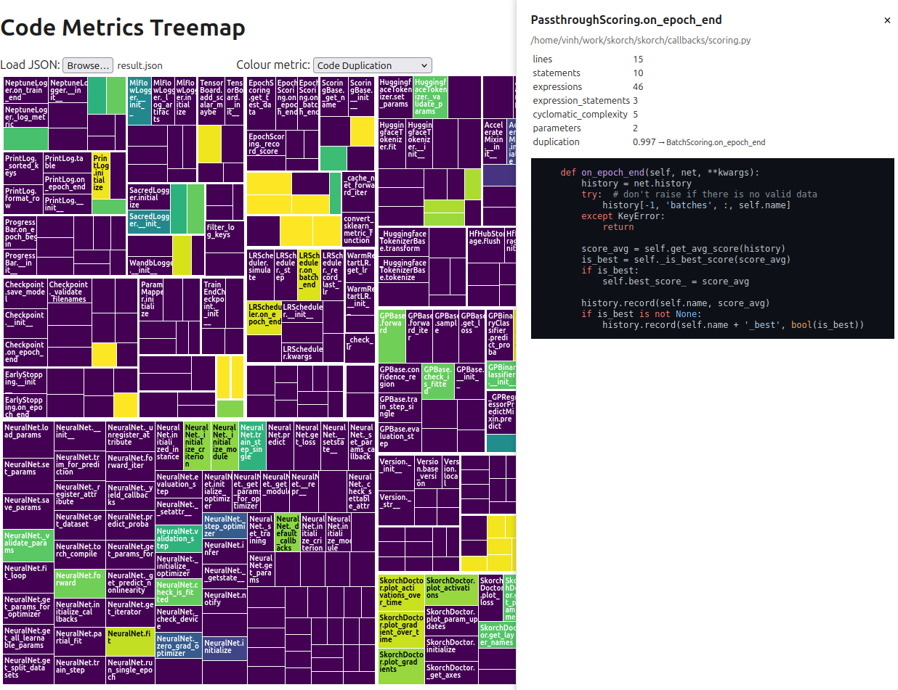

# Code-Map

> **Static code explorer for Python projects**

## Usage

### Generate the report

Clone this repository, then run:

```bash
# Analyse one or more directories / files
python main.py src/ tests/ -o report.json

# Dry-run (shows which .py files will be parsed)
python main.py src/ --dry-run
```

The command walks every given path recursively, analyses each `.py` file and writes a report (default: `result.json`).

### Open the web viewer

Simply open **`index.html`** in any modern browser (no server needed). Click *Load JSON* and select the file you just generated.

* Treemap tiles are sized by *log(lines)*.
* Colour by any metric – complexity, expressions, statements, lines, code duplication.
* Hover for a quick tooltip, click for full source code



_Note: The code was mostly vibe-coded with ChatGPT o3_
