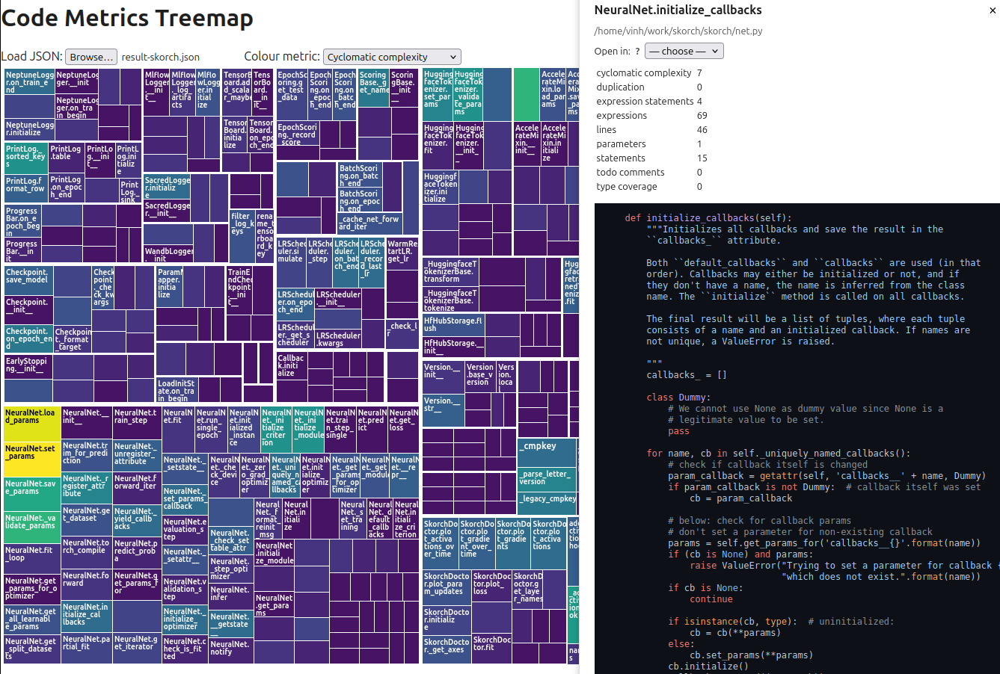

# Code-Map

> **Static code explorer for Python projects**

## Usage

### Generate the report

Clone this repository, then run:

```bash
# Analyse one or more directories / files
python main.py src/ tests/ -o report.json

# Ignore specific files or folders
python main.py src/ -I src/generated.py docs/legacy/

# Dry-run (shows which .py files will be parsed)
python main.py src/ --dry-run

# Skip the (slow) duplication analysis
python main.py src/ --no-duplication
```

The command walks every given path recursively, analyses each `.py` file and writes a report (default: `result.json`). Simple progress bars show the current file or duplication analysis step. Use `-I/--ignore` to provide one or more files or directories that should be skipped during the analysis.

The package has no third party dependencies.

### Open the web viewer

Simply open **`index.html`** in any modern browser (no server needed). Click *Load JSON* and select the file you just generated.

* Treemap tiles are sized by *log(lines)*.
* Colour by any metric – complexity, expressions, statements, lines, type coverage, code duplication.
* Hover for a quick tooltip, click for full source code
* Open the selected file at the right line in your editor via the detail pane (hover the question mark for details)
* Summary statistics above the treemap show general counts and metric-specific insights

### Screenshot

Below is an example of what you could see in the browser.



The treemap contains blocks, with each block corresponding to a function/method. Each of these blocks is grouped according to the file/module it is found in. If the name is not visible because the block is too small, place the curser over the block. Use the mouse wheel to zoom in and drag to pan if needed (click "Reset View" on the top left to return to the default view). The colour of the blocks encodes the selected metric, so e.g. for "Expressions", purple means few expressions and yellow means a lot of expressions.

To show more details, click on a block. This will open a detailed view, including the metrics for this function and the source code. If signficant code duplication was detected, the most similar function will also be mentioned.

## Dev

Note: The code was mostly vibe-coded with ChatGPT o3 and ChatGPT 5.

### Formatting & Linting

```sh
ruff check .
ruff format .
```

### Type checking

```sh
mypy .
```

### Functional test

```sh
python main.py .
```
